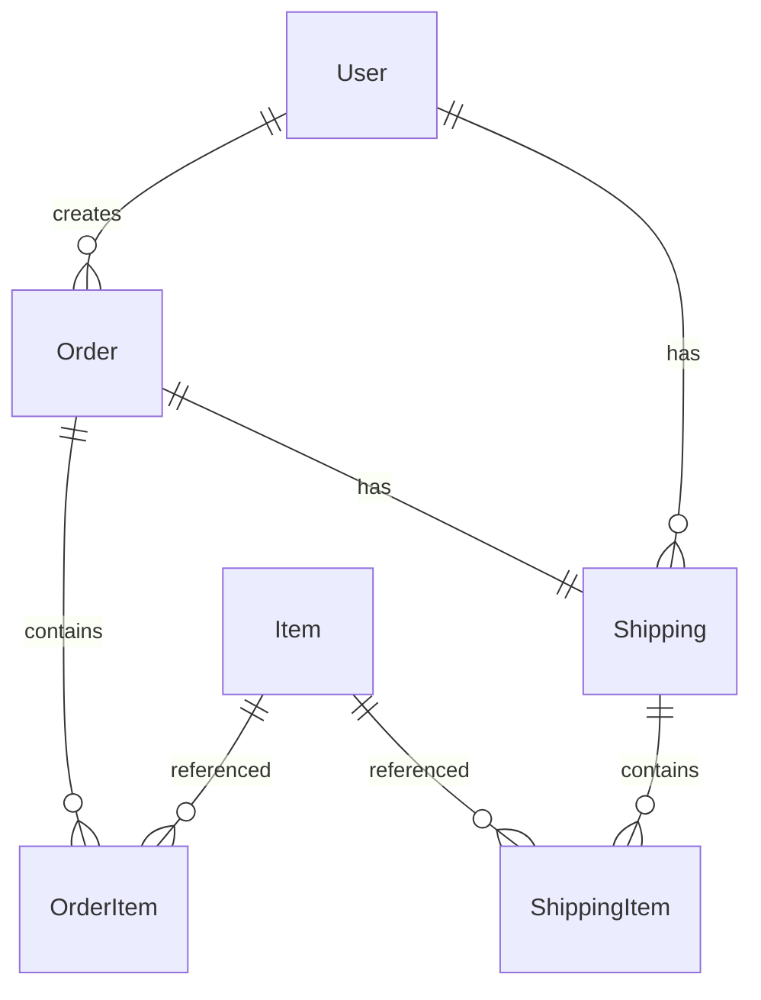

# Sistema de Gestión de Pedidos y Envíos

## Descripción
Sistema backend desarrollado con NestJS para la gestión de pedidos y envíos, con autenticación JWT y documentación Swagger.

## Requisitos Técnicos
- Node.js
- PostgreSQL 
- NestJS
- Prisma ORM
- Jest para pruebas unitarias

## Instalación

```bash
# Clonar el repositorio
git clone [https://github.com/Angeldadro/prueba-tecnica-nestjs]

# Instalar dependencias
npm install

# Configurar variables de entorno
cp .env.example .env
# Editar .env con tus credenciales

# Generar cliente de Prisma
npx prisma generate

# Ejecutar migraciones
npx prisma migrate dev
```

## Estructura del Proyecto
```
src/
├── contexts/
│   ├── orders/        
│   ├── shippings/     
│   ├── users/          
|   └── shared/           
└── main.ts              
```

## Modelo de Datos

### Diagrama ER


### Modelos de Prisma

#### User
```prisma
model User {
  id        String   @id
  email     String   @unique
  password  String
  role      String
  orders    Order[]
  shippings Shipping[]
  createdAt DateTime @default(now())
  updatedAt DateTime @updatedAt
}
```

#### Order
```prisma
model Order {
  id                String      @id
  status            String
  totalAmount       Float
  paymentGatewayRef String?
  createdAt         DateTime    @default(now())
  user              User        @relation(fields: [userId], references: [id])
  userId            String
  orderItems        OrderItem[]
  shipping          Shipping?
}
```

#### OrderItem
```prisma
model OrderItem {
  id           String @id
  order        Order  @relation(fields: [orderId], references: [id])
  orderId      String
  itemId       String
  quantity     Int
  priceAtOrder Float
}
```

#### Shipping
```prisma
model Shipping {
  id              String   @id
  order           Order    @relation(fields: [orderId], references: [id])
  orderId         String   @unique
  status          String
  street          String
  city            String
  state           String
  zipCode         String
  country         String
  shippingItems   ShippingItem[]
  user            User     @relation(fields: [userId], references: [id])
  userId          String
}
```

#### ShippingItem
```prisma
model ShippingItem {
  id           String   @id
  shipping     Shipping @relation(fields: [shippingId], references: [id])
  shippingId   String
  itemId       String
  quantity     Int
  priceAtOrder Float
}
```

#### Item
```prisma
model Item {
  id          String  @id
  name        String
  description String?
  price       Float
  stock       Int
}
```

## Documentación de la API

La documentación de la API está disponible en Swagger UI:
- URL: `http://localhost:3000/api/`
- Autenticación: JWT Bearer Token (usar /auth/login)


## Comandos Disponibles

```bash
# Desarrollo
npm run start          
npm run start:dev      
npm run start:debug   

# Base de datos
npx prisma generate
npx prisma migrate dev

```